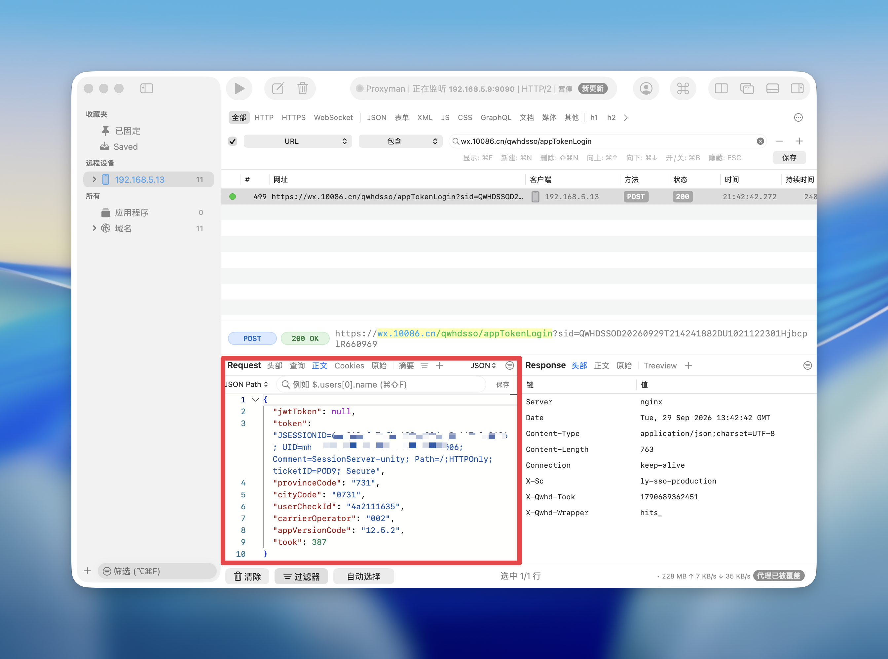

# 中国移动 App 自动签到（签到领流量/话费）

基于抓包逆向的中国移动 App「网签领流量」H5 活动自动签到脚本。
单文件 Python，仅依赖 `requests`。

## 文件说明

| 文件 | 说明 |
|------|------|
| `cmcc_sign.py` | 主脚本 |
| `cmcc_extra.py` | 可选拓展模块：代币任务 / AI豆任务 / 抽奖消耗（`--tasks` / `--games`） |
| `cmcc_seckill.py` | 假期秒杀抢券脚本(20-5门槛券) |
| `cmcc_rate.py` | 评价有礼：每周自动满分评价 + 评价币兑换（`--exchange`） |
| `config.example.json` | 配置模板，复制为 `config.json` 后填写 |
| `.cmcc_jwt_cache_<尾号>.json` | 运行后按账号自动生成的 jwt 凭证缓存（勿外传） |
| `images/app-token-capture.png` | app_token 抓包位置示例图 |

## 快速开始

```bash
pip3 install requests
cp config.example.json config.json   # 填入自己的 app_token 和手机号
python3 cmcc_sign.py                 # 签到
python3 cmcc_sign.py --dry-run       # 只查状态
python3 cmcc_sign.py --claim         # 签到后顺带尝试领连签奖励
python3 cmcc_sign.py --delay 600     # 随机延迟 0~600 秒执行（防风控）
python3 cmcc_sign.py --tasks         # 签到 + 顺带领签到页 AI豆任务
python3 cmcc_sign.py --games         # 三拓展活动：打卡 + 代币任务 + 到窗口自动抽奖
python3 cmcc_sign.py --games --dry-run   # 只报各活动状态与余额，零消耗
python3 cmcc_seckill.py --dry-run        # 秒杀：查场次/校时/资格（活动期）
python3 cmcc_rate.py --dry-run           # 评价有礼：查机会/余额/档位
```

`--tasks` / `--games` 依赖同目录的 `cmcc_extra.py`（缺失时自动跳过并提示，不影响主签到）。

配置也可用环境变量覆盖（适合 CI）：`CMCC_APP_TOKEN`、`CMCC_PHONE`、
`CMCC_PROVINCE_CODE`、`CMCC_CITY_CODE`、`CMCC_ACTIVITY_ID` 等。

## 如何获取 app_token（凭证）

1. 手机装抓包工具（Proxyman / Charles / Stream 等），对 App 开启 SSL 抓包；
2. 打开中国移动 App → 我的 → 签到领流量 进入签到页；
3. 在抓包记录中找到 `wx.10086.cn/qwhdsso/appTokenLogin` 这条 POST 请求；
4. 复制请求体里 `token` 字段的完整值（形如
   `JSESSIONID=xxxx; UID=xxxx; Comment=...; ticketID=NingBo`）填入配置。
   尾部的 `Secure`/`Path` 等 Cookie 属性标记可留可删，服务端只解析 `JSESSIONID`/`UID` 名值对。



省编码 `provinceCode`、市编码 `cityCode` 也在同一条请求体里，一并照抄。
`app_token` 属于账号登录凭证，**只在本地使用，不要提交到公开仓库**。

### jwt 续期（抓一次包即可长期使用）

首次运行会用 `app_token` 引导登录，服务端同时签发一个账号级 jwt 并缓存到
`.cmcc_jwt_cache_<尾号>.json`。之后每次运行脚本**优先用 jwt 续期**
（实测 jwt 不受 App 内切换登录影响，app_token 失效后依然可用），
`app_token` 仅在 jwt 缺失或失效时作兜底引导。

因此日常无需反复抓包；只有当脚本同时报「jwt 续期失败」和
「appTokenLogin 失败」并推送通知时，才需要重新抓包更新 `app_token`。
缓存按手机尾号隔离并校验归属，多账号/换号配置不会串用凭证。

## 定时执行

### macOS launchd / crontab

```bash
crontab -e
# 每天早上 8 点 23 分执行（避开整点）
23 8 * * * cd /path/to/cmcc-auto-checkin && /usr/bin/python3 cmcc_sign.py --delay 1800 >> sign.log 2>&1
```

### GitHub Actions

`.github/workflows/sign.yml`（注意：在 App 内切换账号登录会使 `app_token` 失效，
使用云上定时方案时请留意凭证状态）：

```yaml
name: cmcc-sign
on:
  schedule:
    - cron: "37 0 * * *"   # UTC 时间，对应北京时间 8:37（分钟避开整点）
  workflow_dispatch:
jobs:
  sign:
    runs-on: ubuntu-latest
    steps:
      - uses: actions/checkout@v4
      - uses: actions/setup-python@v5
        with: { python-version: "3.12" }
      - run: pip install requests
      - run: python cmcc_sign.py --delay 3600
        env:
          CMCC_APP_TOKEN: ${{ secrets.CMCC_APP_TOKEN }}
          CMCC_PHONE: ${{ secrets.CMCC_PHONE }}
          CMCC_BARK_URL: ${{ secrets.CMCC_BARK_URL }}  # 可选
```
## 通知（可选）

- **Server酱**：填 `serverchan_sendkey`，签到结果推送到微信；
- **Bark**（iOS）：填 `bark_url`（形如 `https://api.day.app/你的key`）。

## 假期秒杀抢券（可选）

「签到有礼」页的限时秒杀（如 5 元话费加赠券）：完成当日签到即获资格，
每日 12:00 开抢、数量有限。会话/配置/通知与 `cmcc_sign.py` 完全共用，
无新增配置字段；当日未签会先自动补签再抢。场次时间以服务端 `secConfig`
返回为准，脚本自动选定进行中/最近的一场，活动改期无需改脚本。

### 快速开始

1. 主签到能跑即可直接用（同一份 `config.json`；多账号加 `--config` 指定）；
2. 查场次与校时：`python3 cmcc_seckill.py --dry-run` —— 列出场次/奖品、
   服务器时钟偏移、资格状态，**不开抢**（注意：资格=当日签到，
   未签时该步会真实补签获取资格）；
3. 实抢：活动期挂上 crontab（见下），或开抢前几分钟手动运行
   `python3 cmcc_seckill.py`，到点自动出手，走 Bark/Server酱 推送。

```bash
python3 cmcc_seckill.py --dry-run    # 查场次/校时/资格，不抢
python3 cmcc_seckill.py --once       # 立即打一发 redeem（验证响应格式）
python3 cmcc_seckill.py              # 常驻等到下一场开抢（12:00 前几分钟启动即可）
python3 cmcc_seckill.py --at 11:59:50 --interval 0.2   # 调参
```

抢购节奏默认提前 0.4 秒出手（`--lead`，抵消网络延迟）、每 0.35 秒一发
（`--interval`，最多 `--max-attempts` 120 发）；redeem 返回 `PRIZE_NO_STOCK`
（抢完）或 `PRIZE_LIMIT_*`（限次）即停，不打空枪。退出码 `0`=抢到、
`1`=未中/异常，便于外层脚本判断。crontab 示例（工作日 11:55 启动，活动期才需要挂着）：

```bash
55 11 * * * cd /path/to/cmcc-auto-checkin && /usr/bin/python3 cmcc_seckill.py >> seckill.log 2>&1
```

## 评价有礼（可选，`cmcc_rate.py`）

「评价得好礼」活动（湖南，2026-12-31 结束）：每周可做一次 App 满意度评价，
满分 10 分得 10 评价币；评价币可兑流量/话费券——500M 月包/1GB 日包 10 币、
2GB 日包/2 元话费券 20 币，每月限兑 4 次，活动结束评价币清零。
会话/配置/通知与 `cmcc_sign.py` 完全共用，无新增配置字段。

### 快速开始

1. 主签到能跑即可直接用（同一份 `config.json`；多账号加 `--config` 指定）；
2. 查状态：`python3 cmcc_rate.py --dry-run` —— 查本周评价机会、评价币
   余额、各档位价格/库存（只读）；
3. 评价与兑换：`python3 cmcc_rate.py` 本周未评则自动满分评价（按 `chance`
   幂等，挂每日定时即可，无需挑时间）；`--exchange` **不带参数默认兑
   「2元话费券」**（余额不足会跳过，适合挂定时攒够 20 币自动兑）；
   `--exchange <prizeId>` 兑指定档位。

档位与 prizeId 对照（以 `--dry-run` 实时输出为准）：

| prizeId | 奖品 | 所需评价币 |
|---------|------|-----------|
| 2020419116 | 1GB流量日包 | 10 |
| 2020419118 | 500M流量月包 | 10 |
| 2020419114 | 2GB流量日包 | 20 |
| 2020419120 | 2元话费券 | 20 |

```bash
python3 cmcc_rate.py --dry-run              # 查机会/余额/档位（只读）
python3 cmcc_rate.py                        # 本周未评则自动满分评价 +10 币
python3 cmcc_rate.py --exchange             # 默认兑 2元话费券（20 币，不足跳过）
python3 cmcc_rate.py --exchange 2020419116  # 兑 1GB流量日包（10 币）
```

字段备注：脚本展示的「评价币余额」来自 `account/query` 的 `balance`；
`prizeStatus.remain` 是「月剩余兑换次数」。评价成功
评价币实时到账，所兑卡券 48 小时内发放至 App「我的奖品」，券有效期 10 天。

## 拓展活动（可选，`cmcc_extra.py`）

同一 SSO 通道（wx.10086.cn / qwhdhub）下还有三类收益，凭证与会话完全复用主脚本
（jwt 续期缓存同样生效），通过 `--tasks` / `--games` 开启：

| 体系 | 内容 | 开关 |
|------|------|------|
| mark/task | 签到页 AI豆任务（到访 + finish + 领奖，57 项中约 1/3 可纯 HTTP 完成） | `--tasks` |
| diyTask | 三活动页代币任务（browse/share 等类型服务端不校验真实行为） | `--games` |
| diyLottery | 抽奖消耗：周六游戏中心（游戏币 10/次，周六 12:00 起奖池拓展）、追剧领福利（次数 1/抽，仅周日开放） | `--games` |

抽奖内置**窗口闸门**：非窗口日只报余额不消耗（游戏币攒到周六拓展池一次抽光，
币按 31 天周期清零），到窗口才真扣；幂等由服务端余额保证，重复运行不多扣资产。
`--dry-run` 下全部只读，零消耗。

活动页 URL / 组件 ID 写在 `cmcc_extra.py` 的 `ACTS` 注册表里，属公开配置；
不同省份入口不同时替换 query 参数即可。

## 实现说明（接口链路）

```
GET  /qwhdsso/login?actUrl=<活动页>          → 提取一次性 sid
POST /qwhdsso/appTokenLogin?sid=...          → {token:App票据,...} 换取跳转 URL
GET  <活动页?token=QWHDSSOD...>              → Set-Cookie: QWHD_SESSION_TOKEN(30分钟)
POST /qwhdhub/api/mark/mark31/markstatus {}  → 查签到状态（幂等）
POST /qwhdhub/api/mark/mark31/domark         → {"date":"YYYYMMDD"} 执行签到
POST /qwhdhub/api/mark/mark31/taskAward/<id> → 领连签奖励（--claim）
```

拓展活动（`cmcc_extra.py`）：

```
POST /qwhdhub/api/mark/task/taskList         → AI豆任务清单（--tasks）
POST /qwhdhub/api/mark/task/finishTask       → 完成（服务端最小校验=到访+Referer，前端 sign 不校验）
GET  /qwhdhub/diyTask/list/<componentId>     → 代币任务清单
POST /qwhdhub/diyTask/finish/<taskId>        → 空 body 即发币
POST /qwhdhub/diyLottery/period/remain/<id>  → 抽奖余额预检（只读）
GET  /qwhdhub/diyLottery/lotterySafely/<id>  → 抽奖一次（无 body，Referer=活动页）
```

评价有礼（`cmcc_rate.py`）：

```
GET  /qwhdhub/assess/markStatus                     → 本周评价机会（chance）
GET  /qwhdhub/assess/assess?score=10&time=<ms>      → 满分评价，+10 评价币
POST /qwhdhub/account/query                         → 评价币余额/账本（balance）
GET  /qwhdhub/activity/info                         → 档位名称与所需评价币
GET  /qwhdhub/assess/prizeStatus                    → 库存/资格 + 月剩余兑换次数
GET  /qwhdhub/assess/redeem?prizeId=<id>&time=<ms>  → 兑换卡券
```

已知坑（脚本内已处理）：

- **TLS 套件**：wx.10086.cn 网关只接受老式 TLS 套件（ECDHE-RSA-AES128-SHA），
  Python 默认现代套件会握手失败，脚本挂载了自定义 SSL 适配器；
- **系统代理**：本机开着抓包/代理工具时证书会被 MITM，脚本已禁用代理继承直连；
- **请求头**：UA 需含 `leadeon`，API 需带 `login-check: 1` 与 `x-requested-with`；
- `domark` 返回 `code=SUCCESS` + `status=PRIZE_NO_CONFIG` 表示签到成功、当日无单日奖品；
- 重复签到服务端返回 `HAVE_MARKED`，脚本视为幂等成功。

仅供个人号码自动化签到使用，请勿高频调用或用于批量账号。
